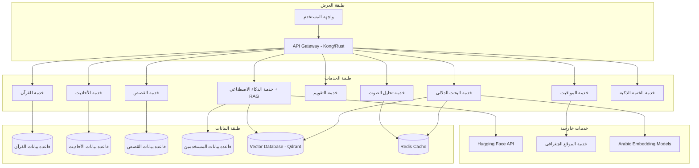

# وثيقة التصميم - التطبيق الإسلامي الشامل

## نظرة عامة

التطبيق الإسلامي الشامل هو منصة رقمية متكاملة تجمع جميع المصادر الإسلامية الأساسية في تطبيق واحد. يتميز التطبيق بهندسة معمارية حديثة تدعم الأداء العالي، البحث المتقدم، والذكاء الاصطناعي المتخصص في الشؤون الإسلامية.

### الأهداف الرئيسية
- توفير مصدر موثوق وشامل للمحتوى الإسلامي
- ضمان دقة النصوص القرآنية والأحاديث النبوية
- تقديم تجربة مستخدم سلسة ومتعددة اللغات
- دمج الذكاء الاصطناعي لتحسين البحث والاستفسارات
- دعم العمل دون اتصال للمحتوى الأساسي

## الهندسة المعمارية

### النمط المعماري
يتبع التطبيق نمط **Microservices Architecture** مع **Clean Architecture** و **API Gateway** لضمان:
- فصل الاهتمامات (Separation of Concerns)
- قابلية التوسع (Scalability)
- سهولة الصيانة والتطوير
- اختبار مستقل لكل مكون
- إدارة موحدة للطلبات والمصادقة
- Rate Limiting وحماية من DDoS

### المكونات الرئيسية



## المكونات والواجهات

### 1. خدمة القرآن الكريم (Quran Service)

**المسؤوليات:**
- إدارة النص القرآني بالرسم العثماني
- توفير التفاسير المختلفة
- دعم البحث في القرآن
- إدارة الترجمات

**الواجهات الرئيسية:**

```typescript
interface QuranService {
  getSurah(surahNumber: number): Promise<Surah>
  getAyah(surahNumber: number, ayahNumber: number): Promise<Ayah>
  searchInQuran(query: string, options: SearchOptions): Promise<SearchResult[]>
  getTafsir(surahNumber: number, ayahNumber: number, tafsirId: string): Promise<Tafsir>
  getTranslation(surahNumber: number, ayahNumber: number, language: string): Promise<Translation>
}

interface Surah {
  number: number
  name: string
  arabicName: string
  englishName: string
  revelationType: 'meccan' | 'medinan'
  numberOfAyahs: number
  ayahs: Ayah[]
}

interface Ayah {
  number: number
  text: string
  surahNumber: number
  juz: number
  page: number
  ruku: number
}
```

### 2. خدمة الأحاديث النبوية (Hadith Service)

**المسؤوليات:**
- إدارة مجموعة الأحاديث النبوية
- تصنيف الأحاديث حسب درجة الصحة
- ربط الأحاديث بشروحها
- البحث في الأحاديث

**الواجهات الرئيسية:**

```typescript
interface HadithService {
  getHadith(hadithId: string): Promise<Hadith>
  searchHadith(query: string, filters: HadithFilters): Promise<HadithSearchResult[]>
  getHadithsByBook(bookName: string): Promise<Hadith[]>
  getHadithsByTopic(topic: string): Promise<Hadith[]>
  getHadithExplanation(hadithId: string): Promise<HadithExplanation>
}

interface Hadith {
  id: string
  text: string
  narrator: string
  chain: string[]
  book: string
  chapter: string
  hadithNumber: string
  grade: HadithGrade
  source: string
}

enum HadithGrade {
  SAHIH = 'صحيح',
  HASAN = 'حسن',
  DAIF = 'ضعيف',
  MAWDU = 'موضوع'
}
```

### 3. خدمة الذكاء الاصطناعي مع نظام RAG (AI Service with RAG)

**المسؤوليات:**
- تنفيذ نظام RAG (Retrieval-Augmented Generation) لضمان دقة الإجابات
- البحث الدلالي في قاعدة البيانات الإسلامية قبل توليد الإجابات
- التفاعل مع نماذج Hugging Face المتخصصة
- معالجة الاستفسارات الدينية مع التحقق من المصادر
- فلترة المحتوى غير المناسب ومنع الاختلاق (Hallucination)

**الواجهات الرئيسية:**

```typescript
interface AIService {
  askQuestionWithRAG(question: string, context: IslamicContext): Promise<RAGResponse>
  retrieveRelevantSources(query: string): Promise<IslamicSource[]>
  validateResponse(response: string, sources: IslamicSource[]): Promise<ValidationResult>
  generateExplanation(concept: string, sources: IslamicSource[]): Promise<Explanation>
  checkHallucination(response: string): Promise<HallucinationCheck>
}

interface RAGResponse {
  answer: string
  confidence: number
  retrievedSources: IslamicSource[]
  citedSources: IslamicSource[]
  relatedQuestions: string[]
  warnings?: string[]
  hallucinationRisk: number
}

interface IslamicSource {
  id: string
  type: 'quran' | 'hadith' | 'tafsir' | 'story'
  content: string
  reference: string
  authenticity?: 'sahih' | 'hasan' | 'daif' | 'mawdu'
  similarity: number
}
```

### 6. خدمة البحث الدلالي المتقدم (Semantic Search Service)

**المسؤوليات:**
- فهرسة جميع المحتويات الإسلامية في Vector Database
- تحويل النصوص إلى Embeddings باستخدام نماذج عربية متخصصة
- البحث الدلالي بدلاً من البحث بالكلمات المطابقة فقط
- ترتيب النتائج حسب التشابه الدلالي (Cosine Similarity)
- دعم البحث بالجذور اللغوية العربية

**الواجهات الرئيسية:**

```typescript
interface SemanticSearchService {
  semanticSearch(query: string, filters: SemanticFilters): Promise<SemanticSearchResult>
  indexContent(content: IslamicContent): Promise<void>
  generateEmbedding(text: string): Promise<number[]>
  findSimilarContent(embedding: number[], threshold: number): Promise<SimilarContent[]>
  searchByMeaning(concept: string, contentTypes: ContentType[]): Promise<ConceptSearchResult[]>
}

interface SemanticSearchResult {
  results: SemanticMatch[]
  totalResults: number
  searchTime: number
  queryEmbedding: number[]
}

interface SemanticMatch {
  content: IslamicContent
  similarity: number
  relevanceScore: number
  highlightedText: string
}
```

### 7. خدمة تحليل الصوت ومصحح التلاوة (Audio Analysis Service)

**المسؤوليات:**
- تحليل تسجيلات التلاوة الصوتية
- مقارنة التلاوة بالتسجيلات المرجعية للقراء
- اكتشاف أخطاء التجويد والنطق
- تتبع تقدم المستخدم في تحسين التلاوة
- توفير تمارين مخصصة لتحسين نقاط الضعف

**الواجهات الرئيسية:**

```typescript
interface AudioAnalysisService {
  analyzeRecitation(audioData: ArrayBuffer, surahNumber: number, ayahRange: AyahRange): Promise<RecitationAnalysis>
  compareWithReference(userAudio: ArrayBuffer, referenceAudio: ArrayBuffer): Promise<ComparisonResult>
  detectTajweedErrors(audioData: ArrayBuffer, expectedText: string): Promise<TajweedError[]>
  trackProgress(userId: string, analysis: RecitationAnalysis): Promise<ProgressUpdate>
  generateExercises(userId: string, weakPoints: TajweedError[]): Promise<Exercise[]>
}

interface RecitationAnalysis {
  overallScore: number
  tajweedAccuracy: number
  pronunciationAccuracy: number
  errors: TajweedError[]
  improvements: string[]
  nextSteps: string[]
}

interface TajweedError {
  type: 'ghunnah' | 'qalqalah' | 'madd' | 'idgham' | 'ikhfa' | 'pronunciation'
  position: TimeRange
  severity: 'minor' | 'moderate' | 'major'
  correction: string
  referenceAudio?: string
}
```

### 8. خدمة الختمة الذكية (Smart Khatma Service)

**المسؤوليات:**
- حساب خطط الختمة التفاعلية بناءً على سرعة القراءة
- تتبع تقدم المستخدم وتعديل الخطة تلقائياً
- إرسال تذكيرات ذكية مخصصة
- تحليل عادات القراءة وتقديم اقتراحات
- إنشاء إحصائيات مفصلة للختمات المكتملة

**الواجهات الرئيسية:**

```typescript
interface SmartKhatmaService {
  createKhatmaPlan(userId: string, targetDate: Date, preferences: KhatmaPreferences): Promise<KhatmaPlan>
  updateProgress(userId: string, readingSessions: ReadingSession[]): Promise<PlanUpdate>
  adjustPlan(planId: string, newConstraints: PlanConstraints): Promise<KhatmaPlan>
  getSmartReminders(userId: string): Promise<SmartReminder[]>
  generateStatistics(userId: string, khatmaId: string): Promise<KhatmaStatistics>
}

interface KhatmaPlan {
  id: string
  userId: string
  targetDate: Date
  dailyPortions: DailyPortion[]
  estimatedReadingTime: number
  adaptiveSchedule: boolean
  currentProgress: number
}

interface DailyPortion {
  date: Date
  surahStart: number
  ayahStart: number
  surahEnd: number
  ayahEnd: number
  estimatedMinutes: number
  completed: boolean
}
```

### 4. خدمة البحث المتقدم (Search Service)

**المسؤوليات:**
- فهرسة جميع المحتويات الإسلامية
- دعم البحث بالجذور اللغوية
- ترتيب النتائج حسب الصلة
- البحث الدلالي المتقدم

**الواجهات الرئيسية:**

```typescript
interface SearchService {
  search(query: string, filters: SearchFilters): Promise<UnifiedSearchResult>
  indexContent(content: IslamicContent): Promise<void>
  getSuggestions(partialQuery: string): Promise<string[]>
  searchByRoot(arabicRoot: string): Promise<RootSearchResult[]>
}

interface UnifiedSearchResult {
  quranResults: QuranSearchResult[]
  hadithResults: HadithSearchResult[]
  storyResults: StorySearchResult[]
  totalResults: number
  searchTime: number
}
```

### 5. خدمة المواقيت والتقويم (Prayer Times & Calendar Service)

**المسؤوليات:**
- حساب مواقيت الصلاة بدقة
- إدارة التقويم الهجري
- إرسال التنبيهات
- دعم المناطق الزمنية المختلفة

**الواجهات الرئيسية:**

```typescript
interface PrayerTimesService {
  calculatePrayerTimes(location: Location, date: Date, method: CalculationMethod): Promise<PrayerTimes>
  getQiblaDirection(location: Location): Promise<QiblaDirection>
  scheduleNotifications(userId: string, preferences: NotificationPreferences): Promise<void>
}

interface CalendarService {
  convertToHijri(gregorianDate: Date): Promise<HijriDate>
  convertToGregorian(hijriDate: HijriDate): Promise<Date>
  getIslamicEvents(month: number, year: number): Promise<IslamicEvent[]>
}
```

## إدارة الحالة والتزامن (State Management & Synchronization)

### نظام التزامن المتقدم

لضمان تجربة سلسة عبر الأجهزة المختلفة، يستخدم النظام:

#### CRDTs (Conflict-free Replicated Data Types)
- **للمفضلة والعلامات المرجعية**: استخدام G-Set و LWW-Register
- **لتقدم القراءة**: استخدام PN-Counter مع timestamps
- **للملاحظات الشخصية**: استخدام RGA (Replicated Growable Array)

#### استراتيجية التزامن
```typescript
interface SyncStrategy {
  // تزامن فوري للبيانات الحرجة
  immediateSync: ['prayer_times', 'khatma_progress']
  
  // تزامن دوري للبيانات الأقل أهمية
  periodicSync: ['bookmarks', 'reading_history', 'preferences']
  
  // تزامن عند الطلب للبيانات الثقيلة
  onDemandSync: ['audio_recordings', 'offline_content']
}

interface ConflictResolution {
  // آخر كتابة تفوز للتفضيلات
  lastWriteWins: ['user_preferences', 'display_settings']
  
  // دمج ذكي للمجموعات
  setUnion: ['bookmarks', 'favorite_surahs']
  
  // أقصى قيمة للتقدم
  maxValue: ['reading_progress', 'khatma_completion']
}
```

### التخزين المحلي الذكي

#### استراتيجية التخزين
- **المحتوى الأساسي**: القرآن الكامل + التفاسير الأساسية (دائماً متاح)
- **المحتوى المتكيف**: الأحاديث والقصص الأكثر استخداماً (تحديث ذكي)
- **المحتوى الشخصي**: المفضلة وتقدم القراءة (تزامن فوري)

#### إدارة المساحة
```typescript
interface StorageManager {
  // حد أدنى مضمون للمحتوى الأساسي
  guaranteedStorage: '500MB'
  
  // تنظيف ذكي للمحتوى القديم
  smartCleanup: {
    unusedContent: '30 days',
    cachedSearches: '7 days',
    audioRecordings: '90 days'
  }
  
  // ضغط البيانات
  compression: {
    textContent: 'gzip',
    audioFiles: 'opus',
    images: 'webp'
  }
}
```

## نماذج البيانات

### نموذج المستخدم

```typescript
interface User {
  id: string
  username: string
  email: string
  preferences: UserPreferences
  bookmarks: Bookmark[]
  readingProgress: ReadingProgress
  createdAt: Date
  lastActiveAt: Date
}

interface UserPreferences {
  language: string
  preferredTafsir: string[]
  prayerCalculationMethod: CalculationMethod
  notificationSettings: NotificationSettings
  displaySettings: DisplaySettings
}
```

### نموذج المحتوى الإسلامي

```typescript
interface IslamicContent {
  id: string
  type: ContentType
  title: string
  content: string
  source: string
  author?: string
  tags: string[]
  language: string
  createdAt: Date
  updatedAt: Date
}

enum ContentType {
  QURAN = 'quran',
  HADITH = 'hadith',
  TAFSIR = 'tafsir',
  STORY = 'story',
  ARTICLE = 'article'
}
```

## خصائص الصحة (Correctness Properties)

الخصائص هي خصائص أو سلوكيات يجب أن تكون صحيحة عبر جميع عمليات التنفيذ الصالحة للنظام - في الأساس، بيان رسمي حول ما يجب أن يفعله النظام. تعمل الخصائص كجسر بين المواصفات المقروءة للإنسان وضمانات الصحة القابلة للتحقق آلياً.

بناءً على تحليل معايير القبول، إليك الخصائص الأساسية للنظام:

### الخاصية 1: سلامة المحتوى الإسلامي
*لأي* محتوى إسلامي (قرآن، حديث، تفسير) في النظام، يجب أن يطابق النص المخزن المصادر الموثوقة الأصلية ويكون محمياً من التحريف أو التلاعب
**يتحقق من: المتطلبات 1.5، 12.3**

### الخاصية 2: دقة البيانات الهيكلية
*لأي* سورة في المصحف، يجب أن يكون عدد الآيات المعروضة مطابقاً للعدد الصحيح مع ترقيم صحيح لكل آية
**يتحقق من: المتطلبات 1.2**

### الخاصية 3: شمولية البحث الموحد
*لأي* استعلام بحث، يجب أن تشمل النتائج جميع أنواع المحتوى الإسلامي (قرآن، أحاديث، قصص، تفاسير) ذات الصلة مرتبة حسب الأهمية
**يتحقق من: المتطلبات 8.1، 8.2**

### الخاصية 4: البحث اللغوي المتقدم
*لأي* جذر لغوي عربي، يجب أن يعيد البحث جميع الكلمات المشتقة من ذلك الجذر عبر جميع النصوص الإسلامية
**يتحقق من: المتطلبات 8.3**

### الخاصية 5: ربط المحتوى بالمصادر الموثوقة
*لأي* محتوى إسلامي (تفسير، حديث، قصة)، يجب أن يكون مرتبطاً بمصدره الأصلي ومؤلفه مع درجة الموثوقية المناسبة
**يتحقق من: المتطلبات 2.2، 2.3، 3.2، 3.3، 4.1**

### الخاصية 6: التصنيف الموضوعي الشامل
*لأي* محتوى إسلامي، يجب أن يكون مصنفاً في الفئات والموضوعات المناسبة مع إمكانية البحث والفلترة حسب هذه التصنيفات
**يتحقق من: المتطلبات 3.5، 4.2، 8.4**

### الخاصية 7: دقة حسابات المواقيت
*لأي* موقع جغرافي وتاريخ، يجب أن تكون مواقيت الصلاة المحسوبة دقيقة وفقاً للمعايير الفلكية وطريقة الحساب المختارة
**يتحقق من: المتطلبات 7.1، 7.4**

### الخاصية 8: تحويل التقويم الهجري (الرحلة المستديرة)
*لأي* تاريخ صالح، تحويله من الهجري إلى الميلادي ثم العكس يجب أن يعيد نفس التاريخ الأصلي
**يتحقق من: المتطلبات 6.2**

### الخاصية 9: نظام التنبيهات الدقيق
*لأي* مناسبة إسلامية أو وقت صلاة، يجب أن تُرسل التنبيهات في الأوقات المحددة بدقة وفقاً لتفضيلات المستخدم
**يتحقق من: المتطلبات 6.4، 7.2، 7.3**

### الخاصية 10: إدارة المفضلة والعلامات المرجعية
*لأي* محتوى يضيفه المستخدم للمفضلة أو يضع عليه علامة مرجعية، يجب أن يُحفظ مع الملاحظات المرتبطة ويكون قابلاً للاسترداد والتنظيم
**يتحقق من: المتطلبات 9.1، 9.2، 9.5**

### الخاصية 11: حفظ التقدم والاستعادة
*لأي* نشاط قراءة للمستخدم، يجب أن يُحفظ التقدم تلقائياً ويُستعاد بدقة عند العودة للمحتوى
**يتحقق من: المتطلبات 9.4، 11.4**

### الخاصية 12: دعم اللغات المتعددة
*لأي* لغة مدعومة، يجب أن تُعرض واجهة المستخدم بتلك اللغة مع الحفاظ على اتجاه النص المناسب والترجمات المتاحة
**يتحقق من: المتطلبات 10.2، 10.3، 10.5**

### الخاصية 13: أداء النظام
*لأي* طلب من المستخدم، يجب أن يستجيب النظام خلال أقل من 3 ثوانٍ مع توفير المحتوى المحفوظ محلياً عند انقطاع الاتصال
**يتحقق من: المتطلبات 11.1، 11.3**

### الخاصية 14: أمان البيانات والمصادقة
*لأي* بيانات حساسة للمستخدم، يجب أن تكون مشفرة ومحمية مع استخدام مصادقة آمنة وتسجيل محاولات الوصول غير المصرح بها
**يتحقق من: المتطلبات 12.1، 12.2، 12.5**

### الخاصية 15: جودة إجابات الذكاء الاصطناعي
*لأي* سؤال ديني، يجب أن تكون إجابة المساعد الذكي مبنية على مصادر موثوقة مع عرض وجهات النظر المختلفة للأسئلة الخلافية ورفض الأسئلة خارج النطاق الإسلامي
**يتحقق من: المتطلبات 5.1، 5.2، 5.3، 5.4**

<function_calls>
<invoke name="prework">
<parameter name="featureName">islamic-app-comprehensive

## معالجة الأخطاء

### استراتيجية معالجة الأخطاء الشاملة

يتبع النظام نهجاً متدرجاً لمعالجة الأخطاء:

1. **المنع (Prevention)**: التحقق من صحة البيانات قبل المعالجة
2. **الاكتشاف (Detection)**: رصد الأخطاء في الوقت الفعلي
3. **الاستعادة (Recovery)**: محاولة الاستعادة التلقائية
4. **التسجيل (Logging)**: توثيق جميع الأخطاء للتحليل
5. **الإبلاغ (Reporting)**: عرض رسائل واضحة للمستخدم

### أنواع الأخطاء ومعالجتها

#### أخطاء البيانات الإسلامية
- **خطأ في النص القرآني**: إيقاف النظام وإرسال تنبيه فوري للمطورين
- **حديث غير موثق**: عرض تحذير مع طلب التحقق من المصدر
- **تفسير مفقود**: عرض التفاسير البديلة المتاحة

#### أخطاء الشبكة والاتصال
- **انقطاع الإنترنت**: التبديل التلقائي لوضع العمل دون اتصال
- **فشل API خارجي**: استخدام البيانات المحفوظة محلياً مع إشعار المستخدم
- **بطء الاستجابة**: عرض مؤشر التحميل مع خيار الإلغاء

#### أخطاء المصادقة والأمان
- **محاولة دخول غير مصرح بها**: تسجيل المحاولة وحظر IP مؤقتاً
- **انتهاء صلاحية الجلسة**: إعادة توجيه لصفحة تسجيل الدخول مع حفظ البيانات
- **بيانات مشبوهة**: تشفير إضافي وتسجيل مفصل

### رسائل الخطأ المحلية

جميع رسائل الخطأ متوفرة باللغات المدعومة:

```typescript
interface ErrorMessages {
  ar: {
    networkError: "خطأ في الاتصال بالشبكة. يرجى المحاولة مرة أخرى."
    dataCorruption: "تم اكتشاف خطأ في البيانات. سيتم الإصلاح تلقائياً."
    unauthorized: "غير مصرح لك بالوصول لهذا المحتوى."
  }
  en: {
    networkError: "Network connection error. Please try again."
    dataCorruption: "Data corruption detected. Auto-repair in progress."
    unauthorized: "You are not authorized to access this content."
  }
}
```

## استراتيجية الاختبار

### نهج الاختبار المزدوج

يتبع النظام استراتيجية اختبار شاملة تجمع بين:

#### الاختبارات الوحدة (Unit Tests)
- **الغرض**: التحقق من أمثلة محددة وحالات الحافة وشروط الخطأ
- **التركيز**: 
  - أمثلة محددة توضح السلوك الصحيح
  - نقاط التكامل بين المكونات
  - حالات الحافة وشروط الخطأ
- **أدوات**: Jest للـ JavaScript/TypeScript، pytest للـ Python

#### اختبارات الخصائص (Property-Based Tests)
- **الغرض**: التحقق من الخصائص العامة عبر جميع المدخلات
- **التركيز**:
  - الخصائص العامة التي تنطبق على جميع المدخلات
  - التغطية الشاملة للمدخلات من خلال العشوائية
- **التكوين**: 
  - الحد الأدنى 100 تكرار لكل اختبار خاصية
  - كل اختبار خاصية يجب أن يشير إلى خاصية وثيقة التصميم
  - تنسيق العلامة: **الميزة: islamic-app-comprehensive، الخاصية {رقم}: {نص الخاصية}**

### مكتبات الاختبار المقترحة

#### للـ JavaScript/TypeScript:
- **fast-check**: لاختبارات الخصائص
- **Jest**: للاختبارات الوحدة
- **Supertest**: لاختبار APIs

#### للـ Python:
- **Hypothesis**: لاختبارات الخصائص  
- **pytest**: للاختبارات الوحدة
- **requests-mock**: لمحاكاة APIs الخارجية

### أمثلة على اختبارات الخصائص

```typescript
// مثال: اختبار خاصية تحويل التقويم الهجري
// الميزة: islamic-app-comprehensive، الخاصية 8: تحويل التقويم الهجري (الرحلة المستديرة)
test('Hijri calendar round trip property', () => {
  fc.assert(fc.property(
    fc.date(), // تاريخ عشوائي
    (date) => {
      const hijriDate = convertToHijri(date);
      const backToGregorian = convertToGregorian(hijriDate);
      // يجب أن يكون التاريخ المُستعاد مطابقاً للأصل (مع هامش خطأ يوم واحد)
      expect(Math.abs(date.getTime() - backToGregorian.getTime())).toBeLessThan(24 * 60 * 60 * 1000);
    }
  ));
});

// مثال: اختبار خاصية سلامة المحتوى الإسلامي
// الميزة: islamic-app-comprehensive، الخاصية 1: سلامة المحتوى الإسلامي
test('Islamic content integrity property', () => {
  fc.assert(fc.property(
    fc.integer(1, 114), // رقم السورة
    fc.integer(1, 286), // رقم الآية (أقصى عدد في البقرة)
    (surahNumber, ayahNumber) => {
      const ayah = getAyah(surahNumber, ayahNumber);
      if (ayah) {
        // النص يجب أن يطابق المصدر الموثوق
        const referenceText = getReferenceAyahText(surahNumber, ayahNumber);
        expect(ayah.text).toBe(referenceText);
        // النص يجب أن يكون محمياً من التعديل
        expect(ayah.isReadOnly).toBe(true);
      }
    }
  ));
});
```

### اختبارات التكامل

- **اختبار التكامل مع APIs خارجية**: Hugging Face، خدمات الموقع الجغرافي
- **اختبار قواعد البيانات**: التحقق من سلامة البيانات والاستعلامات المعقدة
- **اختبار الأداء**: قياس أوقات الاستجابة تحت الأحمال المختلفة
- **اختبار الأمان**: فحص الثغرات الأمنية ومحاولات الاختراق

### اختبارات المستخدم النهائي

- **اختبار قابلية الاستخدام**: مع مستخدمين من خلفيات ثقافية مختلفة
- **اختبار إمكانية الوصول**: للمستخدمين ذوي الاحتياجات الخاصة
- **اختبار متعدد اللغات**: التحقق من دقة الترجمات والتخطيط
- **اختبار الأجهزة المختلفة**: الهواتف الذكية، الأجهزة اللوحية، أجهزة الكمبيوتر

### معايير جودة الاختبار

- **تغطية الكود**: 90% كحد أدنى للكود الأساسي
- **تغطية الخصائص**: كل خاصية في وثيقة التصميم لها اختبار مقابل
- **اختبار الانحدار**: تشغيل تلقائي مع كل تغيير في الكود
- **اختبار الأداء**: قياس منتظم لأوقات الاستجابة واستهلاك الذاكرة

هذا التصميم الشامل يضمن بناء تطبيق إسلامي موثوق وعالي الجودة يخدم المجتمع الإسلامي العالمي بأفضل ما يمكن.