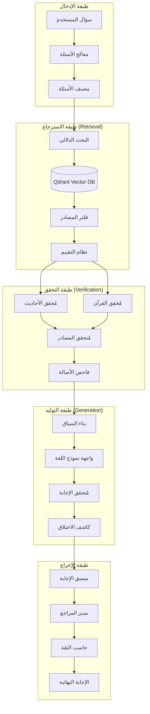

# تصميم نظام RAG للذكاء الاصطناعي - التطبيق الإسلامي الشامل

## نظرة عامة

نظام RAG (Retrieval-Augmented Generation) هو النواة الأساسية للمساعد الذكي في التطبيق الإسلامي الشامل. يهدف هذا النظام إلى ضمان دقة الإجابات الدينية ومنع اختلاق الآيات والأحاديث من خلال البحث في المصادر الموثوقة قبل توليد الإجابة.

## الأهداف الرئيسية

1. **منع الاختلاق (Anti-Hallucination)**: ضمان عدم اختلاق آيات أو أحاديث غير صحيحة
2. **الدقة العلمية**: ربط كل إجابة بمصادرها الموثوقة
3. **التحقق من الصحة**: فحص درجة صحة الأحاديث قبل العرض
4. **الشمولية**: عرض وجهات النظر المختلفة للمسائل الخلافية
5. **الأمان**: رفض الأسئلة خارج النطاق الإسلامي

## مخطط تدفق البيانات



## مكونات النظام التفصيلية

### 1. معالج الأسئلة (Question Processor)

**المسؤوليات:**
- تنظيف وتطبيع النص المدخل
- استخراج الكلمات المفتاحية والمفاهيم
- تحديد نوع السؤال (عقيدة، فقه، تفسير، حديث، إلخ)
- ترجمة الأسئلة غير العربية إلى العربية للبحث

```rust
pub struct QuestionProcessor {
    pub text_normalizer: TextNormalizer,
    pub keyword_extractor: KeywordExtractor,
    pub concept_extractor: ConceptExtractor,
    pub translator: Option<Translator>,
}

pub struct ProcessedQuestion {
    pub original_text: String,
    pub normalized_text: String,
    pub keywords: Vec<String>,
    pub concepts: Vec<String>,
    pub question_type: QuestionType,
    pub language: Language,
    pub complexity_level: ComplexityLevel,
}

pub enum QuestionType {
    Aqeedah,      // عقيدة
    Fiqh,         // فقه
    Tafsir,       // تفسير
    Hadith,       // حديث
    Sirah,        // سيرة
    Akhlaq,       // أخلاق
    General,      // عام
    OutOfScope,   // خارج النطاق
}
```

### 2. نظام البحث الدلالي المتقدم

**المسؤوليات:**
- تحويل السؤال إلى vector embedding
- البحث في قاعدة البيانات الشعاعية
- ترتيب النتائج حسب التشابه الدلالي
- فلترة النتائج حسب نوع المحتوى والموثوقية

```rust
pub struct SemanticSearchEngine {
    pub embedding_model: ArabicEmbeddingModel,
    pub vector_db: QdrantClient,
    pub similarity_threshold: f32,
    pub max_results: usize,
}

pub struct SearchResult {
    pub content: IslamicContent,
    pub similarity_score: f32,
    pub relevance_score: f32,
    pub source_type: SourceType,
    pub authenticity_level: AuthenticityLevel,
}

pub enum SourceType {
    Quran,
    SahihHadith,
    HasanHadith,
    DaifHadith,
    Tafsir,
    FiqhRuling,
    ScholarOpinion,
}
```

### 3. نظام التحقق من صحة الأحاديث

**المسؤوليات:**
- فحص سند الحديث وصحته
- التحقق من درجة الحديث (صحيح، حسن، ضعيف، موضوع)
- ربط الحديث بمصادره الأصلية
- فلترة الأحاديث الضعيفة أو الموضوعة عند الحاجة

```rust
pub struct HadithVerificationSystem {
    pub hadith_database: HadithDatabase,
    pub authenticity_checker: AuthenticityChecker,
    pub source_validator: SourceValidator,
    pub grading_system: HadithGradingSystem,
}

pub struct HadithVerificationResult {
    pub hadith_id: String,
    pub text: String,
    pub grade: HadithGrade,
    pub narrator_chain: Vec<String>,
    pub source_books: Vec<String>,
    pub scholar_opinions: Vec<ScholarOpinion>,
    pub verification_confidence: f32,
    pub usage_recommendation: UsageRecommendation,
}

pub enum HadithGrade {
    Sahih,      // صحيح
    Hasan,      // حسن
    Daif,       // ضعيف
    Mawdu,      // موضوع
    Unknown,    // غير معروف
}

pub enum UsageRecommendation {
    HighlyRecommended,  // يُنصح بالاستخدام بقوة
    Recommended,        // يُنصح بالاستخدام
    Cautious,          // استخدام بحذر مع التنبيه
    NotRecommended,    // لا يُنصح بالاستخدام
    Forbidden,         // ممنوع الاستخدام
}
```

### 4. نظام تقييم المصادر (Source Scoring System)

**المسؤوليات:**
- تقييم موثوقية المصادر المسترجعة
- حساب درجة الصلة بالسؤال
- ترتيب المصادر حسب الأولوية
- تحديد الحد الأدنى للثقة المطلوب

```rust
pub struct SourceScoringSystem {
    pub relevance_calculator: RelevanceCalculator,
    pub authority_evaluator: AuthorityEvaluator,
    pub freshness_assessor: FreshnessAssessor,
    pub consensus_checker: ConsensusChecker,
}

pub struct SourceScore {
    pub relevance_score: f32,      // درجة الصلة (0.0 - 1.0)
    pub authority_score: f32,      // درجة الموثوقية (0.0 - 1.0)
    pub authenticity_score: f32,   // درجة الأصالة (0.0 - 1.0)
    pub consensus_score: f32,      // درجة الإجماع (0.0 - 1.0)
    pub final_score: f32,          // الدرجة النهائية
    pub confidence_level: ConfidenceLevel,
}

pub enum ConfidenceLevel {
    VeryHigh,   // ثقة عالية جداً (> 0.9)
    High,       // ثقة عالية (0.7 - 0.9)
    Medium,     // ثقة متوسطة (0.5 - 0.7)
    Low,        // ثقة منخفضة (0.3 - 0.5)
    VeryLow,    // ثقة منخفضة جداً (< 0.3)
}

impl SourceScoringSystem {
    pub fn calculate_score(&self, source: &IslamicSource, query: &ProcessedQuestion) -> SourceScore {
        let relevance = self.relevance_calculator.calculate(source, query);
        let authority = self.authority_evaluator.evaluate(source);
        let authenticity = self.calculate_authenticity_score(source);
        let consensus = self.consensus_checker.check_consensus(source);
        
        let final_score = (relevance * 0.4) + (authority * 0.3) + (authenticity * 0.2) + (consensus * 0.1);
        
        SourceScore {
            relevance_score: relevance,
            authority_score: authority,
            authenticity_score: authenticity,
            consensus_score: consensus,
            final_score,
            confidence_level: self.determine_confidence_level(final_score),
        }
    }
}
```

### 5. آلية منع الاختلاق (Anti-Hallucination Mechanism)

**المسؤوليات:**
- فحص الإجابة المولدة للتأكد من عدم اختلاق معلومات
- التحقق من وجود مصادر لكل ادعاء في الإجابة
- اكتشاف التناقضات مع المصادر الموثوقة
- تقييم مستوى الثقة في الإجابة

```rust
pub struct AntiHallucinationSystem {
    pub fact_checker: FactChecker,
    pub source_verifier: SourceVerifier,
    pub consistency_checker: ConsistencyChecker,
    pub confidence_assessor: ConfidenceAssessor,
}

pub struct HallucinationCheckResult {
    pub is_hallucination_detected: bool,
    pub hallucination_risk_score: f32,
    pub unsupported_claims: Vec<String>,
    pub contradictions: Vec<Contradiction>,
    pub confidence_score: f32,
    pub recommendation: ResponseRecommendation,
}

pub struct Contradiction {
    pub claim: String,
    pub contradicting_source: IslamicSource,
    pub severity: ContradictionSeverity,
}

pub enum ContradictionSeverity {
    Critical,    // تناقض خطير
    Major,       // تناقض كبير
    Minor,       // تناقض طفيف
    Stylistic,   // اختلاف في الأسلوب فقط
}

pub enum ResponseRecommendation {
    Approve,              // الموافقة على الإجابة
    ApproveWithWarning,   // الموافقة مع تحذير
    Revise,              // مراجعة الإجابة
    Reject,              // رفض الإجابة
    RequestHumanReview,  // طلب مراجعة بشرية
}

impl AntiHallucinationSystem {
    pub fn check_response(&self, response: &GeneratedResponse, sources: &[IslamicSource]) -> HallucinationCheckResult {
        let facts = self.fact_checker.extract_facts(&response.text);
        let mut unsupported_claims = Vec::new();
        let mut contradictions = Vec::new();
        
        for fact in facts {
            if !self.source_verifier.verify_fact(&fact, sources) {
                unsupported_claims.push(fact.claim);
            }
            
            if let Some(contradiction) = self.consistency_checker.check_consistency(&fact, sources) {
                contradictions.push(contradiction);
            }
        }
        
        let hallucination_risk = self.calculate_hallucination_risk(&unsupported_claims, &contradictions);
        let confidence = self.confidence_assessor.assess_confidence(response, sources);
        
        HallucinationCheckResult {
            is_hallucination_detected: hallucination_risk > 0.3,
            hallucination_risk_score: hallucination_risk,
            unsupported_claims,
            contradictions,
            confidence_score: confidence,
            recommendation: self.determine_recommendation(hallucination_risk, confidence),
        }
    }
}
```

## استراتيجيات التحقق المتقدمة

### 1. التحقق من الآيات القرآنية

```rust
pub struct QuranVerificationSystem {
    pub quran_database: QuranDatabase,
    pub text_matcher: ExactTextMatcher,
    pub reference_validator: ReferenceValidator,
}

impl QuranVerificationSystem {
    pub fn verify_ayah(&self, text: &str, reference: Option<&str>) -> QuranVerificationResult {
        // البحث عن النص في القرآن الكريم
        let matches = self.text_matcher.find_exact_matches(text);
        
        if matches.is_empty() {
            return QuranVerificationResult {
                is_valid: false,
                error: Some("النص غير موجود في القرآن الكريم".to_string()),
                suggestions: self.find_similar_ayahs(text),
            };
        }
        
        // التحقق من صحة المرجع إذا تم توفيره
        if let Some(ref_str) = reference {
            if !self.reference_validator.validate_reference(ref_str, &matches) {
                return QuranVerificationResult {
                    is_valid: false,
                    error: Some("المرجع المذكور غير صحيح".to_string()),
                    correct_references: matches.iter().map(|m| m.reference.clone()).collect(),
                };
            }
        }
        
        QuranVerificationResult {
            is_valid: true,
            verified_ayahs: matches,
            error: None,
            suggestions: Vec::new(),
            correct_references: Vec::new(),
        }
    }
}
```

### 2. نظام الكشف عن المحتوى المشبوه

```rust
pub struct SuspiciousContentDetector {
    pub banned_phrases: HashSet<String>,
    pub controversial_topics: HashSet<String>,
    pub out_of_scope_indicators: Vec<String>,
}

impl SuspiciousContentDetector {
    pub fn analyze_content(&self, content: &str) -> ContentAnalysisResult {
        let mut flags = Vec::new();
        
        // فحص العبارات المحظورة
        for phrase in &self.banned_phrases {
            if content.contains(phrase) {
                flags.push(ContentFlag::BannedPhrase(phrase.clone()));
            }
        }
        
        // فحص المواضيع الحساسة
        for topic in &self.controversial_topics {
            if content.contains(topic) {
                flags.push(ContentFlag::ControversialTopic(topic.clone()));
            }
        }
        
        // فحص المحتوى خارج النطاق
        for indicator in &self.out_of_scope_indicators {
            if content.contains(indicator) {
                flags.push(ContentFlag::OutOfScope(indicator.clone()));
            }
        }
        
        ContentAnalysisResult {
            is_suspicious: !flags.is_empty(),
            flags,
            risk_level: self.calculate_risk_level(&flags),
            recommendation: self.get_recommendation(&flags),
        }
    }
}
```

## نظام إدارة السياق الذكي

### بناء السياق المحسن

```rust
pub struct ContextBuilder {
    pub max_context_length: usize,
    pub source_prioritizer: SourcePrioritizer,
    pub context_optimizer: ContextOptimizer,
}

impl ContextBuilder {
    pub fn build_context(&self, question: &ProcessedQuestion, sources: &[ScoredSource]) -> GenerationContext {
        // ترتيب المصادر حسب الأولوية
        let prioritized_sources = self.source_prioritizer.prioritize(sources, question);
        
        // بناء السياق مع مراعاة حدود الطول
        let mut context = GenerationContext::new();
        let mut current_length = 0;
        
        for source in prioritized_sources {
            let source_text = self.format_source_for_context(&source);
            
            if current_length + source_text.len() <= self.max_context_length {
                context.add_source(source, source_text);
                current_length += source_text.len();
            } else {
                // محاولة ضغط المصدر أو تلخيصه
                if let Some(compressed) = self.context_optimizer.compress_source(&source, self.max_context_length - current_length) {
                    context.add_source(source, compressed);
                    break;
                }
            }
        }
        
        context
    }
}
```

## معايير الجودة والأداء

### مؤشرات الأداء الرئيسية (KPIs)

1. **دقة الاسترجاع**: نسبة المصادر الصحيحة المسترجعة
2. **دقة التوليد**: نسبة الإجابات الصحيحة المولدة
3. **معدل الاختلاق**: نسبة الإجابات المختلقة المكتشفة
4. **وقت الاستجابة**: متوسط وقت الإجابة على الأسئلة
5. **رضا المستخدم**: تقييم المستخدمين لجودة الإجابات

### حدود الأداء المستهدفة

```rust
pub struct PerformanceTargets {
    pub max_response_time: Duration,           // 5 ثوانٍ كحد أقصى
    pub min_source_confidence: f32,            // 0.7 كحد أدنى للثقة
    pub max_hallucination_risk: f32,           // 0.1 كحد أقصى لخطر الاختلاق
    pub min_citation_coverage: f32,            // 0.9 كحد أدنى لتغطية المراجع
    pub max_concurrent_requests: usize,        // 100 طلب متزامن
}
```

## خطة التنفيذ التدريجية

### المرحلة الأولى: الأساسيات
1. إعداد قاعدة البيانات الشعاعية (Qdrant)
2. تنفيذ نظام البحث الدلالي الأساسي
3. إنشاء نظام التحقق من الآيات القرآنية
4. تطوير آلية التحقق من الأحاديث الأساسية

### المرحلة الثانية: التحسينات
1. تطوير نظام تقييم المصادر المتقدم
2. تنفيذ آلية منع الاختلاق
3. إضافة دعم للأسئلة المعقدة والخلافية
4. تحسين أداء النظام وسرعة الاستجابة

### المرحلة الثالثة: الميزات المتقدمة
1. إضافة دعم للغات متعددة
2. تطوير نظام التعلم التكيفي
3. تنفيذ واجهة المراجعة البشرية
4. إضافة تحليلات متقدمة ومراقبة الأداء

هذا التصميم يضمن بناء نظام RAG موثوق وآمن يخدم المجتمع الإسلامي بأعلى معايير الدقة والأمانة العلمية.